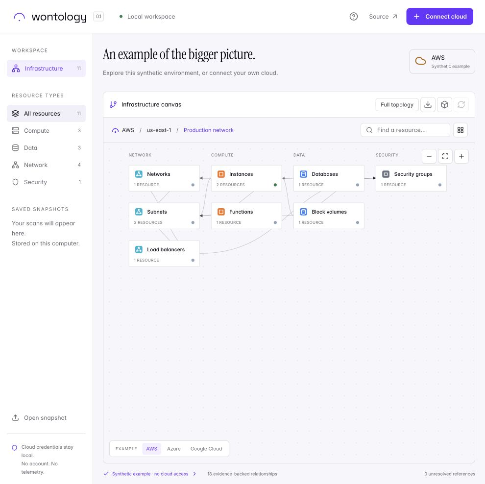

# wontology

**Your cloud infrastructure, mapped.**

Wontology turns AWS, Azure, and Google Cloud configuration into an evidence-backed ontology and a navigable diagram. Run it locally, connect an existing cloud session, and explore resources and their relationships. No Wagner account, signup, AI API key, or hosted backend is required.



## Run locally

Requires Python 3.11 or newer. Node.js is only needed when changing the frontend.

```bash
git clone https://github.com/wagneragent/wontology.git
cd wontology
python3 -m venv .venv
source .venv/bin/activate
python -m pip install -c requirements.lock .
wontology
```

On Windows, activate with `.venv\Scripts\Activate.ps1`. Open **http://127.0.0.1:8787** if the browser does not open automatically.

The app starts with a synthetic AWS environment. Switch between AWS, Azure, and GCP examples without granting any cloud access. Select **Connect cloud** to scan your own environment using an existing local cloud session. Read the [cloud setup guide](docs/cloud-setup.md) for credentials and minimum permissions.

```bash
# Alternative port, data location, or headless startup
wontology --port 8788 --data-dir ./local-data --no-browser
```

Snapshots are stored in `~/.wontology/snapshots.sqlite3` by default. Deleting that directory removes local history; it does not modify cloud resources.

## Explore

- Discover AWS resources in selected regions, Azure resources in a subscription, or GCP assets in a project.
- Navigate the Wagner canvas from region → VPC/network → service → resource. Use breadcrumbs, search by name/ID/type/tag, and the resource atlas to jump through your infrastructure.
- Switch to the full topology for pan, zoom, category filters, and grouping by type and location.
- Select a resource to inspect its immediate connections and the configuration evidence behind each relationship.
- See permission failures, incomplete scans, and unresolved references explicitly.
- Save scans locally, reopen snapshots, import/export the ontology as JSON, and export a diagram as SVG.
- Extend the ontology through reviewed YAML classification and relationship rules.

Resources appear after collector batches complete. Full scan duration depends on cloud size, permissions, network latency, and provider limits. A complete scan means the configured collectors completed; it does not mean every cloud service is covered.

## Cloud coverage and release status

**0.1.0 is an early public release.** All three connectors are implemented and tested with synthetic/mocked provider responses. Live cloud validation has not yet been performed for this release. See [coverage and limitations](docs/coverage.md) before relying on a diagram for operational decisions.

| Cloud | Inventory | Relationship examples |
| --- | --- | --- |
| AWS | 17 explicit metadata collectors: networking, EC2, Lambda, RDS, EBS, S3, IAM roles, ECR, SNS, logs, KMS | VPC/subnet containment, network placement, security groups, volume attachments, encryption keys, execution roles |
| Azure | Paginated Azure Resource Graph `Resources`, plus nested subnet extraction | VM/NIC, NIC/subnet, subnet/VNet, security groups, managed disks, database/cluster subnet references |
| GCP | Paginated Cloud Asset Inventory `RESOURCE` content | Instance/network/subnet, subnet/network, disk attachments, firewall/network, forwarding rules, private SQL network |

Cloud configuration proves structural relationships. A shared network or IAM permission does not prove runtime communication. Wontology does not synthesize application dependencies, infer health from connectivity, or ask an LLM to invent topology.

## Privacy and access

The application serves bundled UI assets from your computer. It has no telemetry, tracking, hosted AI calls, or Wagner authentication. Cloud requests go directly to the selected provider using the provider's local credential chain. Wontology does not accept pasted credentials in the browser.

Collectors use explicit metadata operations. No deployment, secret-value retrieval, storage-object download, database-content access, or infrastructure mutation is implemented. Use metadata-only cloud permissions even if your normal identity has broader access.

Raw payload fields are removed before saving snapshots; selected sensitive field names are redacted. **Metadata, resource names, tags, IDs, and properties can still be confidential.** Review exports before sharing. The local database is protected by file permissions where supported, not encrypted by Wontology. See [SECURITY.md](SECURITY.md).

## Docker

```bash
docker compose up --build
```

Open http://127.0.0.1:8787. This starts example mode without credentials. The image builds the frontend from its lockfile and installs the Python application. For real cloud scans, mount or configure credentials as described in [cloud setup](docs/cloud-setup.md#docker-credentials). Docker packaging is provided but was not locally executed during initial release validation.

## Development

```bash
python -m pip install -e '.[dev]'
cd web
npm ci
npm run check
npm test
npm run build
cd ..
python -m pytest -q
wontology --no-browser
```

Rebuild the frontend after edits, then reload the browser. The Python package includes the built UI, so end users do not need Node.js. Built assets are committed; CI verifies that they match source. CI covers Python 3.11–3.14 on Linux plus Python 3.12 on Windows and macOS.

```text
src/wontology/
  connectors/       Read-only provider collection
  ontology/         Shared graph model, rules, taxonomy, projection
  static/           Bundled local frontend
  server.py         Local API and background scan runner
  store.py          SQLite snapshot storage
web/src/            Wagner navigable canvas and React Flow topology
tests/              Graph, connector, persistence, and HTTP boundary tests
examples/           Synthetic snapshots for all three providers
```

Read [architecture](docs/architecture.md), [ontology extensions](docs/ontology.md), [roadmap](docs/roadmap.md), and [contribution guidance](CONTRIBUTING.md).

## License

Apache License 2.0. See [LICENSE](LICENSE) and [third-party notices](THIRD_PARTY_NOTICES.md).

Wontology is extracted from Wagner's ontology engine, The Score design system, and navigable infrastructure canvas, with a standalone local runtime and provider connectors. The original SaaS application, credentials, private history, billing, chat, and provisioning services are excluded.
