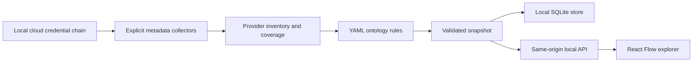

# Architecture

`wontology` starts a loopback HTTP server and opens the browser. The initial synthetic example does not initialize cloud credentials. A scan request starts a background thread for a single selected provider scope. Connector modules define all callable operations; there is no arbitrary cloud API dispatcher or shell command execution.

The ontology package is extracted from Wagner's pure graph model, provider registry, YAML normalization, classification, and projection code. It has no dependency on Wagner users, organization membership, SQLAlchemy tenant policies, Redis, Celery, LangGraph, vector stores, or LLM services. React Flow preserves the existing application's infrastructure-canvas approach; the standalone React shell removes the SaaS onboarding and chat dependencies. Next.js SSR is unnecessary for this local application, so an esbuild bundle is served by Python.

Every relationship carries evidence, rule identity, confidence, and observation time. Authoritative snapshots reject duplicate identities, dangling edges, inferred edges, and edges without evidence. Alias ambiguity stays unresolved. Snapshot and bundle versions allow exported graphs to be interpreted reproducibly.

The local persistence layer saves immutable snapshots. A query for last-complete state ignores partial scans. The server currently permits one active scan; it returns progress snapshots through polling. Credentials stay in the cloud SDK/runtime credential chain and are not stored in SQLite. Raw payload fields are dropped and selected sensitive metadata keys are redacted before persistence.

The local server rejects unexpected Host and Origin headers, requires JSON for mutations, and assigns an automatic HttpOnly SameSite=Strict cookie to the local browser. This protects the local cloud-reading surface without introducing a user identity or login screen. It is not a remote multi-user authentication mechanism.

The UI and all assets are served locally. The public source link and attribution links navigate externally only when clicked.
